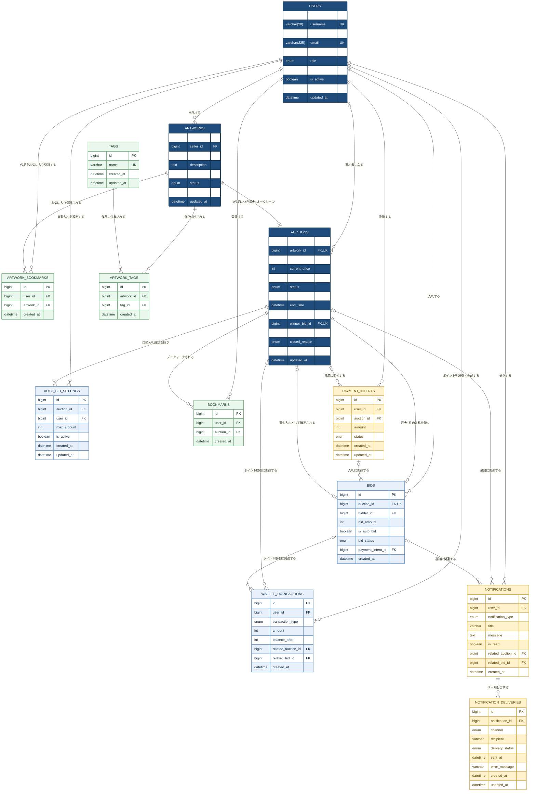

# ER図（Mermaid）

[`DB-deploy/deploy.sql`](../DB-deploy/deploy.sql)の有効なテーブル定義・外部キー・一意制約をもとにしたHEW Ver0.5のER図です。詳細な型・デフォルト値・運用方針は[`db設計.md`](db設計.md)を参照してください。1作品に対するオークションは0〜1件、1オークションに対する入札も現行SQLの一意制約により0〜1件です。

エンティティ名は図中で大文字に統一しています。`||`は必須の1件、`o|`は0〜1件、`o{`は0件以上を表します。属性の`UK`は単一カラムの一意制約を示し、複合一意制約は補足に記載します。数値型の`UNSIGNED`、NULL許可、ENUMの値、デフォルト値はDB設計書に記載します。

## 補足

- `users.email`は`VARCHAR(225)`、`username`は`VARCHAR(20)`で、いずれも一意かつ必須とする。画面表示用の`disp_name`は`VARCHAR(50) NOT NULL`で、一意制約・DBのDEFAULT指定はない。SQLのコメントに従い、Flask側で`user{user.id}`形式の初期値を設定する想定である。
- PNG保存時に`artworks`へ`draft`を作成し、作者が出品設定を完了した時だけ`auctions`を作成して`listed`へ更新する。
- `auctions.artwork_id` の一意制約により、1作品を複数回出品できない。初期実装ではオークション作成と同時に`active`となる。
- `bids.auction_id`は必須かつ一意のため、同一オークションへの複数入札は保存できない。
- `auctions.winner_id`と`winner_bid_id`はNULLを許可する。`winner_bid_id`は一意で、1入札が落札入札として参照されるオークションは最大1件となる。同じオークションの入札か、落札者と入札者が一致するかはアプリケーション側で検証する。
- `bookmarks` は `user_id` と `auction_id` の組み合わせを一意にする。
- `artwork_bookmarks` は `user_id` と `artwork_id` の組み合わせを一意にする。オークションと作品のお気に入りを混在させない。
- `TAGS`と`artwork_tags`により、作品とタグを多対多で関連付ける。`artwork_tags`は`artwork_id`と`tag_id`の組み合わせを一意にする。SQLでは作成名が`TAGS`、外部キーの参照名が`tags`のため、テーブル名の大文字・小文字を区別する環境では不一致の解消が必要となる。
- オークションの出品者は `auctions.artwork_id → artworks.seller_id` から取得し、`auctions` には保持しない。
- ポイントの即時減算・高値更新時の返却はアプリケーション側の運用方針である。現行SQLの`bids.auction_id`の一意制約では、複数入札を履歴として保存する運用と整合しない。
- `auto_bid_settings` は `auction_id` と `user_id` の組み合わせを一意にする。
- `payment_intents`の`provider`、`provider_intent_id`、`currency`はSQLでコメントアウトされており、図にも含めない。
