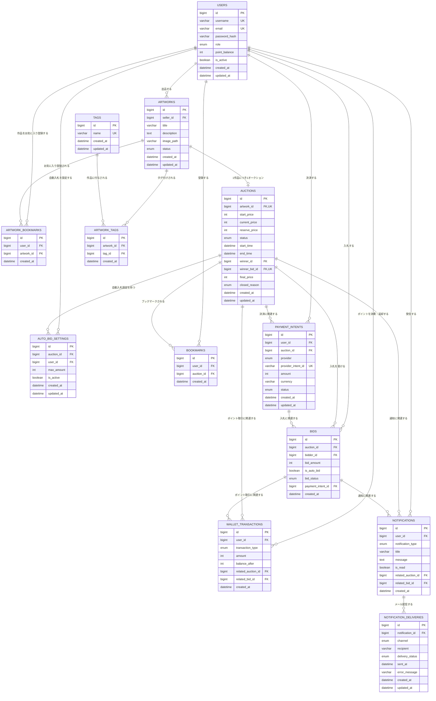

# ER図

`db設計.md` をもとにしたHEW Ver0.5のER図です。メールアドレス認証、下書き保存後の出品、即時開始オークション、ポイントの即時減算・返却を含みます。作品とオークションは再出品なしの1対1です。

## 補足

- `users.email` はログインIDであり、一意かつ必須とする。`username`は画面表示用のユーザー名である。
- PNG保存時に`artworks`へ`draft`を作成し、作者が出品設定を完了した時だけ`auctions`を作成して`listed`へ更新する。
- `auctions.artwork_id` の一意制約により、1作品を複数回出品できない。初期実装ではオークション作成と同時に`active`となる。
- `auctions.winner_bid_id` は、オークション終了時に確定した落札入札を示す。
- `bookmarks` は `user_id` と `auction_id` の組み合わせを一意にする。
- `artwork_bookmarks` は `user_id` と `artwork_id` の組み合わせを一意にする。オークションと作品のお気に入りを混在させない。
- `tags` と `artwork_tags` により、作品とタグを多対多で関連付ける。
- オークションの出品者は `auctions.artwork_id → artworks.seller_id` から取得し、`auctions` には保持しない。
- 受理した最高入札は入札者のポイントを即時減算し、次の高値入札時に前最高入札者へ`refund`として返却する。両方の履歴は`wallet_transactions`に記録する。
- `auto_bid_settings` は `auction_id` と `user_id` の組み合わせを一意にする。
