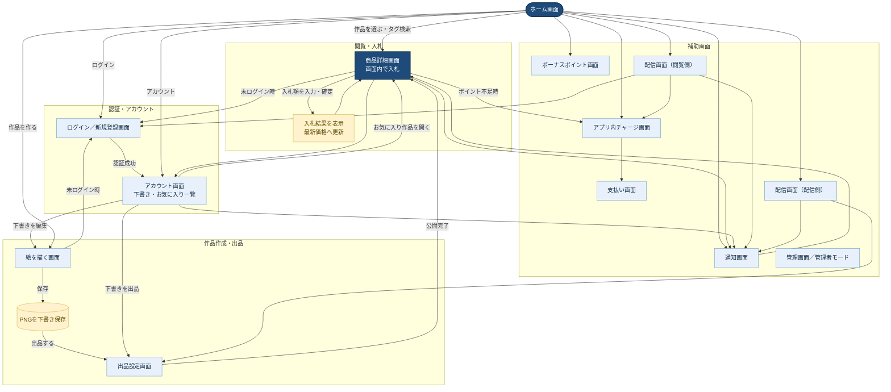

# 画面遷移図

`画面遷移図-memo.md` をもとにした画面遷移図です。入札は商品詳細画面内で完結し、作品は下書き保存後に作者が出品を選択します。

## 補足

- 商品詳細画面では、作品・オークションのお気に入りを登録または解除できる。
- ホーム画面では、タグを指定して作品を検索できる。
- 入札結果は商品詳細画面内に再表示し、専用の入札画面には遷移しない。
- 描画画面で保存したPNGは下書きとして保持し、作者だけが編集・出品できる。
- 画面番号3の入札画面は廃止済みである。
